# <div align="center">✨ Muhammad Sameed Shah ✨</div>

<div align="center">
  
[](https://git.io/typing-svg)

</div>

<div align="center">
  
  
  
</div>

---


### 🌟 About Me

```typescript
const sameed = {
    role: "AI-Driven Full Stack Developer",
    location: "Karachi, Pakistan 🇵🇰",
    experience: "1 year of building intelligent systems",
    
    currentlyLearning: [
        "OpenAI SDK & Advanced Prompting",
        "Multi-Agent Orchestration",
        "Python for AI/ML"
    ],
    
    philosophy: "Code + Intelligence = Magic ✨",
    
    askMeAbout: [
        "Building with Next.js & Supabase",
        "AI automation with n8n",
        "Agentic AI workflows",
        "Specs-driven development"
    ],
    
    funFact: "I believe apps should think, not just respond 🧠"
};
```

<br clear="right"/>

---

## 🎯 What I Do

<div align="center">

| 🤖 **AI Integration** | 🚀 **Full Stack Dev** | ⚡ **Automation** |
|:---:|:---:|:---:|
| OpenAI SDK & GPT Models | Next.js + React | n8n Workflow Design |
| Multi-Agent Systems | Supabase Backend | API Orchestration |
| Prompt Engineering | TypeScript Apps | Voice-to-Text Pipelines |

</div>

---

## 💻 Tech Arsenal

<div align="center">

### 🎨 Frontend Magic


### ⚙️ Backend Power


### 🤖 AI & Automation


### 🛠️ Tools & Platforms


</div>

---

## 🚀 Featured Projects

<div align="center">

<table>
<tr>
<td width="50%">

### 🎬 Vidify AI — SaaS Platform


**AI-Powered Content Generation Suite**

🔹 Image, Video, Music & Code generation  
🔹 OpenAI APIs integration  
🔹 Clerk authentication  
🔹 Next.js + TypeScript + Tailwind

[🔗 View Project](https://github.com/Sameedshah/vidifyai) | [🚀 Live Demo](https://vidify-ai.vercel.app)

</td>
<td width="50%">

### 💪 Gym Management System


**Complete Gym Operations Platform**

🔹 Member & payment management  
🔹 Auto-expiry & fee reminders  
🔹 Real-time check-ins with Hikvision  
🔹 PostgreSQL (Supabase) backend

[🔗 View Project](https://github.com/Sameedshah/gym-management-dashboard)

</td>
</tr>

<tr>
<td width="50%">

### 📊 Financial Data Analyst AI


**AI-Powered Market Analysis Tool**

🔹 Market metrics analysis  
🔹 Visual statistics & charts  
🔹 Predictive analytics  
🔹 Real-time data visualization

[🔗 View Project](https://github.com/Sameedshah/financial-data-analyst) | [🚀 Live Demo](https://visualai-eight.vercel.app)

</td>
<td width="50%">

### 🎯 Lead Generation SaaS


**AI-Powered Lead Scraping Platform**

🔹 Google Maps & Search scraping  
🔹 Multi-country support  
🔹 n8n automation workflows  
🔹 LLM-powered data enrichment

[🔗 View Project](https://github.com/Sameedshah/lead-generation-saas) 

</td>
</tr>
</table>

</div>

---

## 📊 GitHub Analytics

<div align="center">
  


</div>

<div align="center">
  
### 💻 Most Used Languages


</div>

---

## 🏆 Achievements & Certifications

<div align="center">


</div>

---

## 🌐 Let's Connect

<div align="center">

[](https://linkedin.com/in/yourlinkedin)
[](https://twitter.com/yourtwitter)
[](https://yourportfolio.com)
[](mailto:youremail@gmail.com)
[](https://github.com/yourusername)

</div>

---

<div align="center">

### 💭 Philosophy

> *"The future of development isn't just about writing code—it's about orchestrating intelligence. Apps that don't just respond, but **think, learn, and act**."*

### ⚡ Current Focus

```mermaid
graph LR
    A[Learning] --> B[OpenAI SDK]
    A --> C[Multi-Agent Systems]
    A --> D[Python AI/ML]
    B --> E[Building Smarter Apps]
    C --> E
    D --> E
    E --> F[Agentic AI Future 🚀]
```



</div>

---

<div align="center">

### 🎯 2025 Goals

- [ ] Master Multi-Agent Orchestration
- [ ] Build 10+ AI-Powered Projects
- [ ] Contribute to Open Source AI Tools
- [ ] Launch Personal AI Development Framework
- [ ] Share Knowledge Through Technical Writing

</div>

---

<div align="center">

### 📈 Contribution Graph


### ⭐ If you like my work, give it a star — it fuels my next innovation!


</div>
